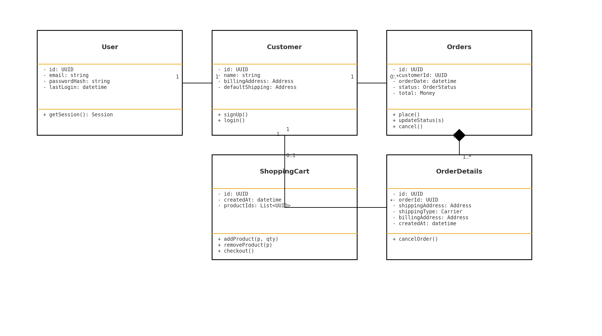

# Tarea #2 – Identificación de Requerimientos  
**Universidad de San Carlos de Guatemala** 

**Facultad de Ingeniería**  

**Escuela de Ciencias y Sistemas**

**Análisis y Diseño de Sistemas 1** 

---

## Introducción  
El desarrollo de un sitio de comercio electrónico implica un proceso de análisis detallado de las necesidades tanto del negocio como de los usuarios finales.  
Identificar los requerimientos funcionales y no funcionales es esencial para establecer una base sólida que garantice el éxito del sistema.  
Los requerimientos funcionales describen lo que el sistema debe hacer (funcionalidades y procesos), mientras que los no funcionales se relacionan con la calidad, seguridad, rendimiento y facilidad de uso del producto.  

En esta tarea se aborda la identificación de dichos requerimientos, tomando como referencia plataformas de comercio electrónico como **Amazon, eBay o Walmart**, y posteriormente se representan mediante un **diagrama de casos de uso UML**, que facilita la comprensión de la interacción entre los actores y el sistema.  

---

## Competencia  
El estudiante es capaz de identificar requerimientos funcionales y no funcionales mediante el análisis de procesos y la elaboración de diagramas de casos de uso.  
Esto permite garantizar que el sistema cumpla con las necesidades del usuario, al mismo tiempo que se mantiene un nivel adecuado de calidad, seguridad y usabilidad.  

---

## Requerimientos Funcionales 
Los requerimientos funcionales detallan las funciones principales que el sistema debe proporcionar para operar de forma correcta.  

1. **Gestión de usuarios**  
   - Registro de nuevos clientes, administradores y vendedores.  
   - Inicio de sesión y cierre de sesión con autenticación segura.  
   - Recuperación de contraseña mediante correo electrónico.  

2. **Catálogo de productos**  
   - Búsqueda avanzada por nombre, categoría, rango de precios o palabras clave.  
   - Filtrado por marcas, valoraciones, disponibilidad y descuentos.  
   - Visualización de fichas de productos con descripción, imágenes y reseñas.  

3. **Carrito de compras y proceso de pago**  
   - Agregar, modificar o eliminar productos en el carrito.  
   - Aplicar cupones o códigos de descuento.  
   - Integración con pasarelas de pago como tarjetas de crédito, PayPal y transferencias bancarias.  
   - Generación de facturas electrónicas.  

4. **Gestión de pedidos y envíos**  
   - Confirmación automática del pedido.  
   - Seguimiento en tiempo real del estado del pedido (pendiente, enviado, entregado).  
   - Integración con servicios externos de logística y transporte.  
   - Posibilidad de devoluciones y solicitudes de reembolso.  

5. **Interacción con clientes**  
   - Sistema de valoraciones y comentarios para cada producto.  
   - Envío de notificaciones por correo electrónico o SMS sobre cambios en el estado del pedido.  
   - Atención al cliente mediante chat o sistema de tickets.  

6. **Panel de administración**  
   - Gestión de inventario y actualización automática de stock.  
   - Administración de productos (crear, modificar, eliminar).  
   - Control de usuarios y permisos.  
   - Generación de reportes de ventas, ingresos y métricas de uso.  

---

## Requerimientos No Funcionales 
Los requerimientos no funcionales aseguran que el sistema, además de cumplir con las funciones, ofrezca calidad, seguridad y buena experiencia al usuario.  

1. **Rendimiento**  
   - El sistema debe ser capaz de manejar al menos **1,000 usuarios concurrentes** sin afectar el tiempo de respuesta.  
   - Las búsquedas deben ejecutarse en menos de **2 segundos** en condiciones normales de carga.  

2. **Disponibilidad y confiabilidad**  
   - El sitio debe estar disponible al menos el **99.9% del tiempo anual**.  
   - Debe contar con respaldo automático de la base de datos cada 24 horas.  

3. **Seguridad**  
   - Las contraseñas deben almacenarse con algoritmos de **hash seguro (bcrypt o Argon2)**.  
   - La comunicación debe realizarse mediante **HTTPS con certificados SSL**.  
   - Protección contra ataques comunes: **SQL Injection, Cross-Site Scripting (XSS), CSRF**.  

4. **Usabilidad**  
   - La interfaz debe ser **intuitiva, clara y accesible**, con compatibilidad para usuarios con discapacidades (WCAG 2.1).  
   - El sistema debe ser **responsive**, adaptándose a computadoras, tablets y móviles.  

5. **Escalabilidad y mantenibilidad**  
   - La arquitectura debe permitir agregar nuevas funcionalidades sin afectar las existentes.  
   - El sistema debe poder escalar horizontal y verticalmente según la demanda (ej. temporadas de ofertas).  

6. **Compatibilidad**  
   - El sitio debe funcionar en los principales navegadores: **Chrome, Firefox, Edge y Safari**.  
   - Debe ser compatible con sistemas operativos actuales (Windows, Linux, macOS, Android, iOS).  

7. **Tiempo de respuesta**  
   - Las páginas principales deben cargar en un máximo de **3 segundos**.  

---

## Actores 
- **Cliente**: navega en la tienda, consulta productos, realiza compras y gestiona pedidos.  
- **Administrador**: controla usuarios, gestiona inventario, revisa reportes y asegura el correcto funcionamiento del sistema.  
- **Vendedor**: publica productos, administra su catálogo y actualiza inventario.  
- **Sistema de pago externo**: procesa las transacciones electrónicas.  
- **Sistema de envíos**: gestiona la logística y transporte de productos.  

---

## Diagrama de Casos de Uso UML 

---

## Conclusión  
La correcta identificación de requerimientos funcionales y no funcionales es fundamental en el proceso de análisis y diseño de un sistema.  
En el caso de un sitio de comercio electrónico, estos aspectos garantizan que la plataforma no solo cumpla con las funciones básicas de compra-venta, sino que también ofrezca un alto nivel de seguridad, rendimiento y experiencia al usuario.  
El uso de diagramas UML facilita la comprensión del alcance del sistema y permite a los desarrolladores, diseñadores y administradores mantener una visión clara y estructurada del proyecto.  

